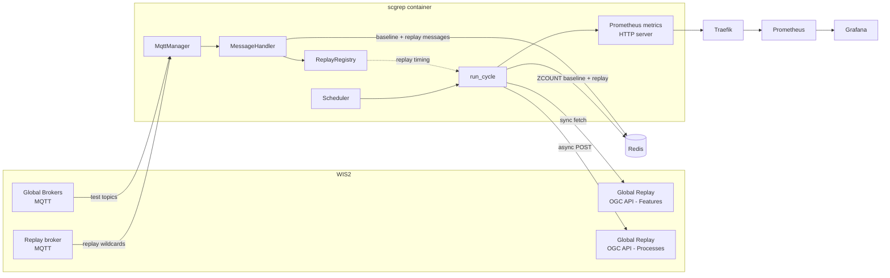
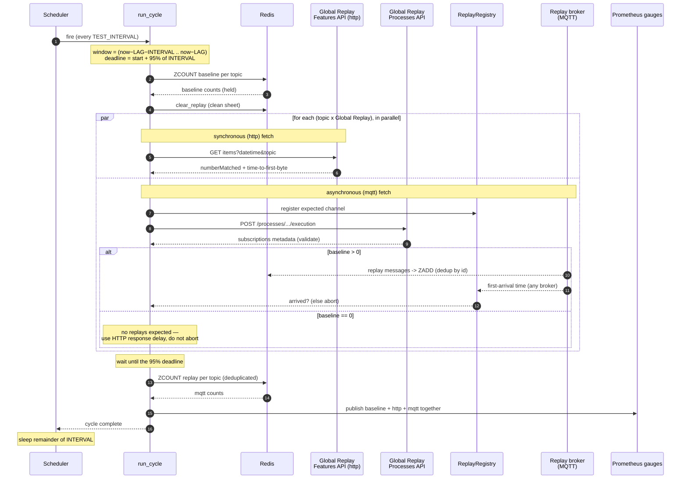

# SCGRep architecture

This document describes how SCGRep is put together: the runtime services in the
Docker stack, the Python components inside the application, and how data flows
through them during a test cycle. For configuration and operation see the
[README](README.md); for the original requirements see
[docs/design-brief.md](docs/design-brief.md).

## What SCGRep does

SCGRep is a WIS2 **Sensor Centre**: a headless background service that measures
how well one or more **Global Replay** services return past messages, compared
with what a live subscriber actually saw on the Global Brokers. It publishes the
results as Prometheus metrics. There is no web UI of its own; a Traefik reverse
proxy, Prometheus, and Grafana are bundled for ingress and visualisation.

## Runtime services (Docker stack)

The `docker-compose.yml` stack runs five services on one Compose-managed bridge
network (`traefik`):

| Service | Image | Role |
| --- | --- | --- |
| `scgrep` | built from `Dockerfile` | the application (this repo) |
| `redis` | `redis:7-alpine` | short-lived state: message dedup + baseline index |
| `traefik` | `traefik:v3.1` | TLS termination and ingress for the metrics endpoint and Grafana-independent dashboard |
| `prometheus` | `prom/prometheus:v3` | scrapes `scgrep:8000/metrics` |
| `grafana` | `grafana/grafana` | dashboards over the Prometheus data |
| `log-purge` | `scgrep` image | hourly job that trims the shared log file (`scripts/purge_logs.py`) |

`scgrep` does not publish a port; Traefik reaches it by service name
(`scgrep:8000`) over the shared network and serves `/metrics` over HTTPS.
Prometheus scrapes the same backend directly on the network. Redis is managed by
the stack and `scgrep` waits for it to be healthy (`depends_on`).

## Application components

Each Python module in the `scgrep/` package has one clear responsibility.

### `config.py` — configuration

Parses and validates every environment variable into an immutable `Config`
dataclass, and parses each MQTT URL into a `BrokerConfig` (host, port, TLS,
credentials). It enforces invariants (e.g. `GLOBAL_REPLAY_CENTRE_IDS` and
`GLOBAL_REPLAY_URLS` must be the same length) and fails fast with a clear error.
It also generates the unique **subscriber UUID** used to build the per-subscriber
replay topics, and derives `redis_expiry = TIME_LAG + TEST_INTERVAL + 60`.

### `mqtt_client.py` — broker connectivity and message routing

`MqttManager` owns the MQTT clients (one paho client per broker) in **two roles**:

- **Global Brokers** (`GLOBAL_BROKER_URLS`) — subscribe to the topics under test
  (`SUBSCRIPTION_TOPICS`) to build the baseline.
- **Replay broker(s)** (`GLOBAL_REPLAY_BROKER_URLS`, comma-delimited; one during
  the preoperational phase) — subscribe to the per-subscriber replay wildcard
  topics `replay/a/wis2/<centre-id>/<subscriber-id>/#`, on which the Global Replay
  service delivers asynchronous replay messages.

Splitting the two roles matters because, in the preoperational phase, the Global
Replay service publishes replays to its own broker (or the WIS2 test Global
Broker) rather than the operational Global Brokers — so the broker used for
replays is configured separately (and can skip TLS verification if its
certificate has lapsed). In the **operational** case, where replays *are* routed
via the Global Brokers, `GLOBAL_REPLAY_BROKER_URLS` is left **blank** and the
replay brokers default to the Global Brokers.

`MqttManager` builds **one client per unique broker** with the union of the
subscriptions it serves. So a broker that is both a Global Broker and a replay
broker (the blank case) is a single connection subscribed to both the test topics
and the replay wildcards — no duplicate client id.

`MessageHandler.on_message` runs on paho's network thread and routes each message:

- topics starting with `replay/` → the `ReplayRegistry` (first-arrival timing)
  **and** Redis (deduplicated per-cycle count); the original topic and centre-id
  are parsed out of the replay channel path;
- everything else → parsed as JSON and stored in Redis (baseline).

### `redis_store.py` — dedup, expiry, and counting (baseline **and** replay)

For each broker message SCGRep stores two things in Redis:

1. `scgrep:msg:<id>` — a short-lived key written with `SET NX EX`. `NX` discards
   duplicate `id`s (the same message legitimately arrives from several Global
   Brokers); `EX` makes records **expire automatically** after `redis_expiry`.
2. `scgrep:topic:<pattern>` — a **sorted set per configured subscription topic**,
   scored by message time. Because a concrete received topic can match several
   configured patterns (including wildcards), the message is indexed into every
   pattern it matches (via MQTT `topic_matches_sub`).

The baseline for a topic/window is then a single `ZCOUNT` over the time range —
using exactly the same topic filter that is sent to the Global Replay service.

**Replay messages are counted the same way**, in a separate keyspace
`scgrep:replay:<centre-id>:<pattern>` (a sorted set scored by message time). The
separate, **centre-scoped** keyspace matters because replayed messages carry the
same `id`s as the originals, and different Global Replay services replay the same
`id`s — so replay records must not clash with the baseline or with each other.
Because a sorted-set **member is unique**, the same `id` delivered by several
replay brokers is stored once — this is what **deduplicates** the operational
multi-broker case for free. `clear_replay` deletes these sets at the start of a
cycle (a clean sheet), and `count_replay_messages` is the `mqtt` count.

The **synchronous** fetch records its messages the same way in yet another
keyspace, `scgrep:sync:<centre-id>:<pattern>` (`store_sync_message` /
`count_sync_messages` / `clear_sync`), kept separate from the baseline and the
replay records for the same reason.

### `replay_registry.py` — timing async replays

`ReplayRegistry` is a thread-safe map from an expected replay **channel** to a
`ReplayCounter`. When an asynchronous test starts it registers the channel it
expects (`replay/a/wis2/<centre-id>/<subscriber-id>/<topic>`) *before* the POST,
so fast replays are not missed. `handle_replay` (called from the MQTT thread)
matches each incoming replay topic to an active channel and records the
**first-arrival time** (for the fetch-delay metric) and whether *any* message
arrived (for abort detection). The registry is used only for **timing**; the
deduplicated *count* comes from Redis (above).

### `replay_tester.py` — the two fetch paths

The topic tree also selects the **collection**: `monitor/a/wis2` and
`replay/a/wis2` topics are served by `wis2-monitoring-event-messages`, everything
else (`origin/`, `cache/`) by `wis2-notification-messages`
(`util.topic_to_collection()`). The synchronous fetch puts it in the request path,
the asynchronous fetch sends it as a `collection` input in the POST payload.

Both paths send the topic as a **level prefix**, not an MQTT filter:
`util.topic_to_query()` strips a trailing `/#` and any trailing `/` before the
request is built (Global Replay `topic` matching is a whole-level prefix with no
wildcards). The configured MQTT form is kept everywhere else — subscriptions,
Redis keys, log lines and the `topic` metric label. `+`/`*` never reach here:
`Config` rejects them at start-up.

- **`sync_fetch`** — OGC API - Features. Issues `GET .../collections/…/items?
  datetime=…&topic=…`, measures time-to-first-byte, reads `numberMatched` (from
  the first page only), then **pages** through every `rel: next` link. For each
  returned Feature it counts it, records it in Redis (`store_sync_message`) and
  logs it. When all pages are in it compares the count of messages actually
  returned with `numberMatched` and sets `invalid_number_matched` (logging an
  error) on a mismatch. Returns aborted if no response arrives before the
  deadline, or invalid-format if `numberMatched` is missing/malformed.
- **`async_fetch`** — OGC API - Processes. POSTs to
  `.../processes/wis2-grep-subscriber/execution`, validates the returned
  `subscriptions` metadata (each channel must sit within the subscriber's
  namespace and every configured broker must appear), then uses the
  `ReplayRegistry` for **timing**. Whether replays are *expected* is decided from
  the replay service's own `numberMatched` (obtained from the parallel
  synchronous fetch), falling back to the Sensor Centre's baseline when that is
  unavailable:
  - if **messages are expected** (`numberMatched > 0`), it waits for the first
    replayed message (fetch delay) and keeps observing until the deadline; if none
    arrive it aborts — so `test_aborted_flag` means "the replay had messages but
    did not deliver them over MQTT in time", not "the replay had a data gap";
  - if **no messages are expected** (`numberMatched == 0`), it does not wait — it
    reports the time-to-first-byte of the HTTP process-execution response as the
    fetch delay and does not abort. A genuine `numberMatched == 0` gap is surfaced
    by the baseline-vs-fetched difference, not by an abort.

  The `mqtt` **count** itself is not taken from here — `run_cycle` reads it from
  Redis (deduplicated) after the fetch completes.

Both return a `FetchResult` (protocol, aborted, invalid-format, fetch-delay,
count); nothing about Prometheus lives here, which keeps the logic testable.

### `test_cycle.py` — orchestrating one cycle

`run_cycle` runs the test for the window
`(now − TIME_LAG − TEST_INTERVAL) .. (now − TIME_LAG)`, **floored to whole
seconds** and **half-open** `[start, end)` — so the baseline `ZCOUNT` and the
ISO-8601 interval sent to the Global Replay (which `epoch_to_iso` truncates to
whole seconds) cover exactly the same interval, and consecutive windows partition
messages exactly once:

1. Read the baseline for every topic from Redis (held, not yet published).
2. `clear_replay` the per-centre replay sets — a clean sheet before any process
   is triggered.
3. Fan out a synchronous **and** an asynchronous fetch for every
   (topic × Global Replay service) pair on a thread pool, so the slow parts run
   in parallel and the cycle fits inside one `TEST_INTERVAL`. Each async fetch is
   given a provider that yields its pair's synchronous `numberMatched` (blocking
   on that future), which gates whether it expects replays.
4. All fetches share one **absolute deadline** anchored to the start of the cycle
   (95% of `TEST_INTERVAL`), so they stop together.
5. For each async result, replace its count with the **deduplicated Redis count**
   (`count_replay_messages`) for the window, when the fetch was not aborted (Redis
   holds zero for a window where no messages were expected, so this is safe).
6. **Update every metric at once** at that 95% instant — baseline, `http`, and
   `mqtt` — so a single Prometheus scrape always sees a consistent set for the
   cycle rather than a mix of old and new values. The two message metrics are
   cumulative **counters** incremented by the cycle's counts (never reset), so
   Grafana derives the per-interval value with the exact 60s delta
   `X - X offset 60s` (integer counts; `increase(...[60s])` would extrapolate to
   non-integer values); the flags and delay are gauges that are set outright.

### `metrics.py` — Prometheus metrics

Defines the metrics (see the [README](README.md#metrics)) in a dedicated registry
and serves them over a tiny WSGI HTTP server at `METRICS_ENDPOINT` on
`METRICS_PORT`, in a daemon thread. The two `messages_*_total`
metrics are cumulative `Counter`s (named without the `_total` suffix, which
prometheus_client appends); the rest are `Gauge`s. Prometheus scrapes every 15s.

### `main.py` — wiring and the scheduler

Loads `Config`, starts the metrics server, waits for Redis to become reachable
(`REDIS_STARTUP_TIMEOUT`), connects the MQTT clients, and runs the `Scheduler`.
The scheduler waits one full `TEST_INTERVAL` before the first cycle, then runs
cycles back-to-back **without overlap** (each cycle completes at ~95% of the
interval, then the loop sleeps the remainder). `SIGTERM`/`SIGINT` stop the loop
and disconnect cleanly. It also configures logging (`LOG_LEVEL`, default `INFO`)
with a UTC-timestamped format; the detailed activity logs (connections, messages,
requests/responses, per-result summaries) are at `INFO` — see the
[README](README.md#logging). When `LOG_FILE` is set, records are also buffered
and written to that file every `LOG_FILE_FLUSH_INTERVAL` seconds via a
`MemoryHandler` → `WatchedFileHandler`; the latter reopens the file if it is
replaced, so the hourly `scripts/purge_logs.py` (the `log-purge` service) can
trim old entries in place while the app keeps writing.

### `util.py` — shared helpers

ISO-8601 ↔ epoch conversion, MQTT topic matching, and normalising broker URLs to
`host:port` (ignoring credentials) for the subscription-metadata check.

## Lifecycle / data flow

**Continuously**, from start-up:

1. Connect to the Global Brokers (test topics) and the replay broker (replay
   wildcards).
2. Every broker message is deduplicated and indexed into Redis; records expire on
   their own after `redis_expiry`.

**Every `TEST_INTERVAL`**, a test cycle:

1. Compute the window, read the per-topic baseline from Redis, and clear the
   replay sets.
2. For each topic and Global Replay service, in parallel:
   - `sync_fetch` → `numberMatched` (`http`);
   - `async_fetch` → POST and time the first replay (or, if the baseline is zero,
     the HTTP response delay). Replays land in Redis via the message handler.
3. Read the deduplicated `mqtt` count from Redis (`ZCOUNT`).
4. At 95% of the interval, publish all metrics together.

Prometheus scrapes `/metrics`; Grafana renders the bundled dashboard.

### A single test cycle

## Key design decisions

- **Two broker roles.** Baseline comes from the Global Brokers; replays are
  received on a separately-configured broker, reflecting the preoperational
  reality that the Global Replay service is not yet publishing replays to the
  operational Global Brokers.
- **Redis as a rolling window.** Dedup keys give idempotency and automatic
  expiry; per-pattern sorted sets make baseline counting a single `ZCOUNT` that
  honours wildcard subscriptions.
- **Same counting for baseline and replay.** Replays are counted in a separate,
  centre-scoped sorted set; sorted-set member uniqueness **deduplicates** the
  same `id` delivered by multiple replay brokers (the operational case), and the
  `mqtt` count is produced exactly like the baseline for a true comparison.
- **Register-before-POST.** The async replay channel is registered before the
  process is triggered so no early replay message is missed.
- **Namespace-prefix channel validation.** The deployed service returns one
  subscriber-scoped wildcard channel, so validation checks the channel is within
  `replay/a/wis2/<centre>/<subscriber>/` rather than an exact per-topic match.
- **Zero-baseline handling.** When nothing was received there is nothing to
  replay, so the async path reports the HTTP response delay instead of waiting
  and aborting.
- **Publish-together at 95%.** A single shared deadline makes all metrics for a
  cycle update at the same instant, so comparisons across `baseline`/`http`/`mqtt`
  are always like-for-like within a scrape.
- **Non-overlapping cycles.** The scheduler never starts a cycle before the
  previous one finishes.

## Concurrency model

SCGRep is threaded, not async:

- each MQTT broker runs its own paho **network thread**, whose callbacks touch
  only thread-safe structures (Redis client, `ReplayRegistry`);
- the **scheduler thread** runs one cycle at a time and fans fetches out to a
  `ThreadPoolExecutor`;
- the **metrics HTTP server** runs in its own daemon thread.

Shared state is limited and guarded: `ReplayCounter`/`ReplayRegistry` use locks,
and the Prometheus client is itself thread-safe.

## Limitations

See the [README](README.md#limitations) and the open
[issues](https://github.com/6a6d74/wis2-scgrep/issues) — notably supporting replay
delivery beyond a single Global Replay instance, and provisioning a
publicly-trusted TLS certificate for non-local deployments.
